<div align="center">



</div>

<div align="center">


[](https://github.com/astral-sh/ruff)
[](https://github.com/psf/black)

<br>

**Intelligent decision capture for your Slack workspace.**

</div>

---

## Overview

Synapse is a Slack-native AI agent that lives in your workspace and listens
for decisions being made. When a team conversation reaches a conclusion —
a deployment date, a tech choice, a process change — Synapse captures it,
stores it, and makes it retrievable later through natural-language questions.

The project is split into two self-contained packages:

| Package | Role |
|---|---|
| [`ai-ml/`](./ai-ml) | Core AI/ML engine: RAG pipeline, web search, decision classifier, local vector store. Zero Slack coupling — could serve any chat interface. |
| [`backend/`](./backend) | Slack Bolt application: event handlers, Block Kit views, service wrappers. Wires the AI engine into Slack and extends it with real-time data sources. |

---

## How it works

1. **A decision is made** — a team member says something like *"Let's go with
   option A and deploy on Friday"* in a Slack channel.
2. **Synapse detects it** — the real-time decision classifier analyses the
   transcript and flags it as a decision, extracting a summary and confidence
   score.
3. **It's stored** — the decision is indexed in a local vector store (NumPy,
   no external infrastructure needed).
4. **Anyone asks** — another team member @mentions Synapse: *"What did we
   decide about deployment?"* — the RAG pipeline retrieves the most relevant
   chunks and synthesises an answer with cited sources.
5. **Fallback to the web** — if the vector store doesn't have enough context,
   Synapse supplements with Brave Search results or, in future, connected
   data sources (Google Drive, GitHub, Slack history).

---

## Repository structure

```
synapse/
├── ai-ml/                 # AI/ML engine — run & test independently
│   ├── src/synapse_ai/
│   ├── tests/
│   ├── pyproject.toml
│   └── README.md          # Setup, CLI usage, configuration
├── backend/               # Slack bot — run & test independently
│   ├── src/synapse_backend/
│   ├── tests/
│   ├── pyproject.toml
│   └── README.md          # Setup, Slack App config, running
└── README.md              # This file
```

---

## Quick start

```bash
# 1. AI/ML module — seed the vector store and test the engine
cd ai-ml
pip install -e ".[dev]"
cp .env.example .env       # fill in OPENAI_API_KEY and BRAVE_API_KEY
pytest                     # 48 tests should pass
python -m synapse_ai.cli seed
python -m synapse_ai.cli ask "What is our deployment policy?"

# 2. Backend — run the Slack bot
cd ../backend
pip install -e ../ai-ml
pip install -e ".[dev]"
cp .env.example .env       # fill in Slack tokens
pytest                     # 11 tests should pass
python -m synapse_backend.app
```

---

## Envisioned capabilities

| Area | Current | Planned |
|---|---|---|
| **Q&A source** | Local vector store + Brave Search | + Google Drive, GitHub, Slack history |
| **Decision capture** | On-demand via transcript | Automatic channel watching, threaded summaries |
| **App Home** | Placeholder | Dashboard of recent decisions, search bar, trend chart |
| **Knowledge base** | Manual `seed` command | Auto-indexing from connected data sources |
| **MCP integration** | — | Connect to MCP servers for structured tool use |
| **Team awareness** | — | Per-team vector stores, channel scoped decisions |

---

## Technology

- **Python 3.11+** (developed and tested on 3.14)
- **Slack Bolt** — Socket Mode (no public URL needed)
- **OpenAI** — embeddings (`text-embedding-3-small`) and chat completions (`gpt-4o-mini`)
- **Brave Search API** — web search fallback
- **NumPy** — pure-Python vector store (no Rust-native extensions)
- **pydantic-settings** — typed environment configuration
- **pytest** — full test coverage with mocked network calls

---

## License

MIT
